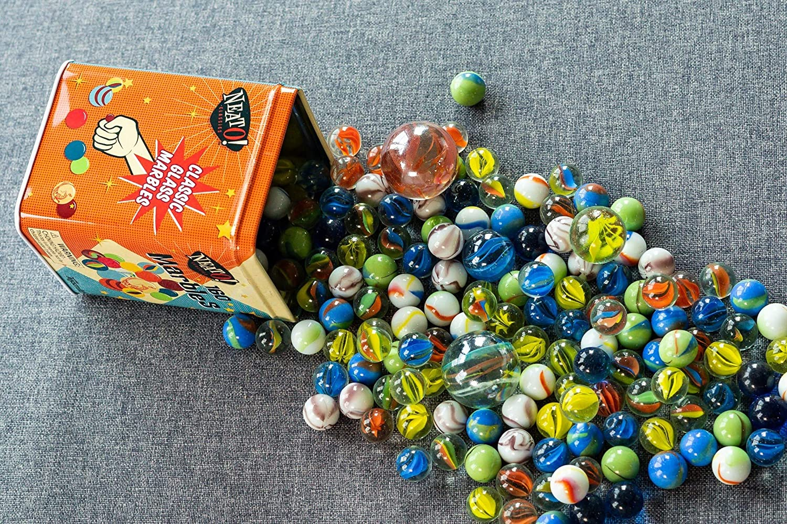
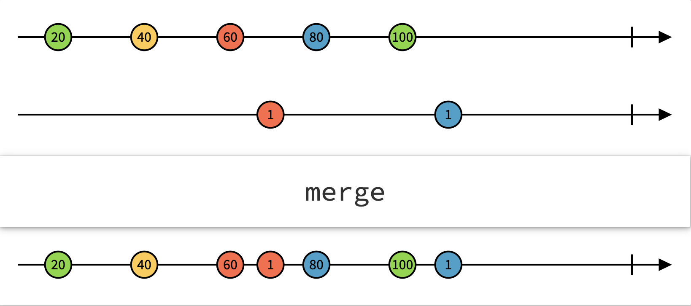
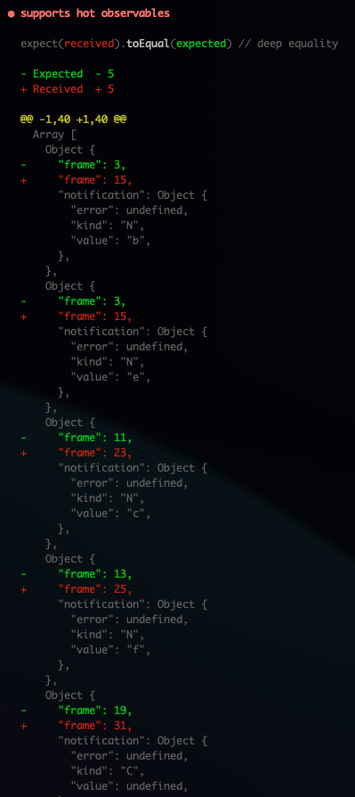

<style>
  code {
    background: #3f3f3f;
    color: #dcdcdc;
  }
</style>

### A RxJS Marble testing journey



---

### What is RxJS?

- Reactive programming in the Frontend & Node
- A (better) way to manage data and events within your app.
- Reactive Extensions, for multiple languages

---

### What are Marble diagrams?



https://rxmarbles.com/

---

### How do we combine those?

- `TestScheduler` API was added in RxJS 6+
- Before it was only intended for maintainers
- Only Schedular-related Observables can be tested
- Uses virtual time

---

### What does it look like?

```
1-2-3|
```

---

- <code>&nbsp;</code> whitespace is used for readability
- `-` frame of virtual 1ms
- `|` end of the stream
- `#` error
- `^` start of subscription
- `!` point of unsubscribing

---

### Syntax examples

#### Emitted seperately

```
a-b-c-d|
```

---

#### All at once

```
---(abcd)|
```

---

### Example setup

- TypeScript
- RxJS
- Jest + TS-Jest - could be anything

---

### Test setup

```ts
const testScheduler = new TestScheduler((actual, expected) => {
  expect(actual).toEqual(expected);
});
```

---

### Business logic to test

```ts
const multiply = (value: Observable<number>) =>
  value.pipe(map((val) => val * 2));
```

---

### The test

```ts
it("multiplies every value", () => {
  testScheduler.run((helpers) => {
    const { cold, expectObservable } = helpers;
    const stream = cold("a-b-c-|", { a: 1, b: 2, c: 3 });
    const expected = "   x-y-z-|";

    expectObservable(stream.pipe(multiply)).toBe(expected, {
      x: 2,
      y: 4,
      z: 6,
    });
  });
});
```

---

### Other logic to test

```ts
const filterLowerThan5 = (value: Observable<number>) =>
  value.pipe(filter((val) => val < 5));
```

---

### The other test

```ts
it("only emits values lower than 5", () => {
  testScheduler.run((helpers) => {
    const { cold, expectObservable } = helpers;
    const stream = cold("   a-b-c-|", { a: 10, b: 2, c: 30 });
    const expected = "--------b---|";

    expectObservable(stream.pipe(filterLowerThan5)).toBe(expected, {
      b: 2,
    });
  });
});
```

---

### Testing hot observables ❌

What I expected to work 🤷‍♂️

```ts
it("supports hot observables", () => {
  testScheduler.run(({ hot, expectObservable }) => {
    const e1 = hot("----a--^--b-------c--        |");
    const e2 = hot("  ---d-^--e---------f-----   |");
    const expected = "     ---(be)-------c-f-----|"; // <---

    expectObservable(merge(e1, e2)).toBe(expected); // fails!
  });
});
```

---

### Testing hot observables ✅

What actually works

```ts
it("supports hot observables", () => {
  testScheduler.run(({ hot, expectObservable }) => {
    const e1 = hot("----a--^--b-------c--        |");
    const e2 = hot("  ---d-^--e---------f-----   |");
    const expected = "---------------(be)----c-f-----|"; // <---

    expectObservable(merge(e1, e2)).toBe(expected); // passes!
  });
});
```

---

### Disclaimer

- Would not test the example logic like this
- `--------b` versus ` a-b` ???
- Timer-like observables not tried testing yet
- Still not understanding some parts, like testing hot observables ➡️

---

### Upsides

- TypeScript all the way
- Very powerful for testing predictive dataflows, like transformations and timings
- Makes dataflows visible

---

### Downsides

- Does not work with Promises or async code
- Readability is not always that great, hard to write
- Intended for RxJS maintainers, limited usecases
- Documentation is pretty much non-exsiting and/or incorrect. Primarily based on RxJS v5
- Marble syntax is different for testing Obervables and Subscriptions
- Failed tests are a bit cryptic
  

---

### Thanks

for listening! 🙌

### Resources

- https://rxjs.dev/guide/testing/marble-testing#testing-rxjs-code-with-marble-diagrams
- https://github.com/ReactiveX/rxjs/blob/7113ae4b451dd8463fae71b68edab96079d089df/docs_app/content/guide/testing/internal-marble-tests.md
- https://www.youtube.com/watch?v=s9FY-MBW1rc
